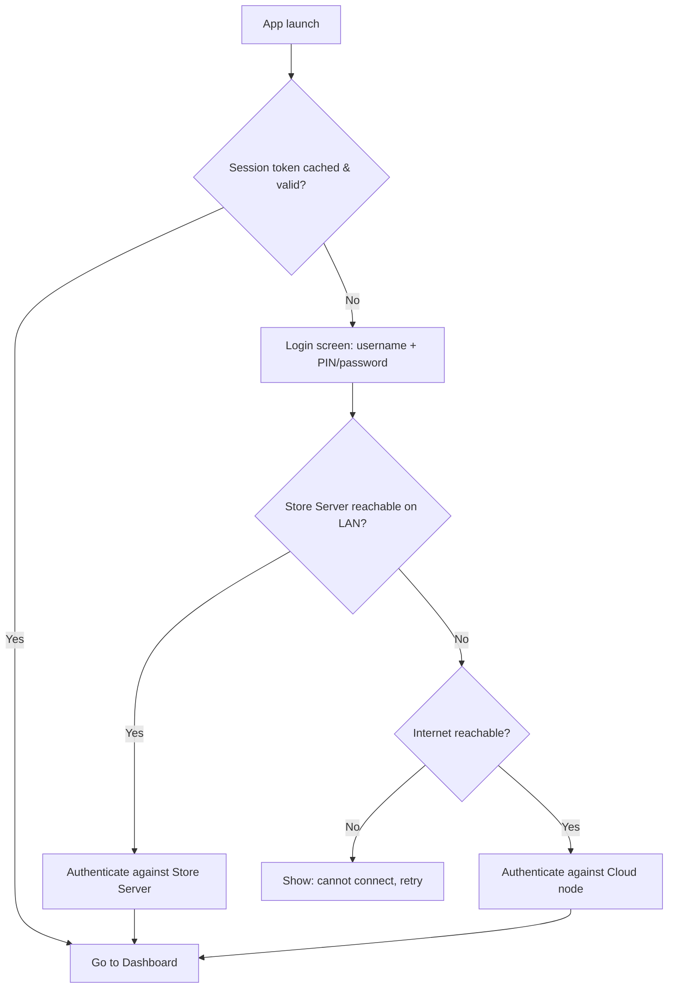
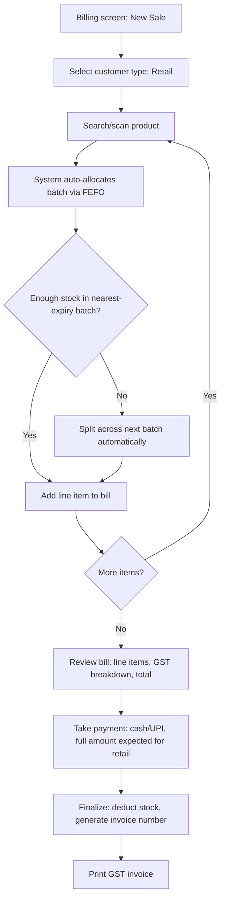
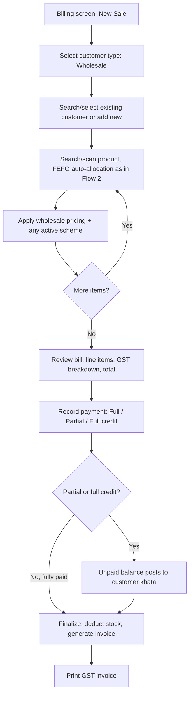
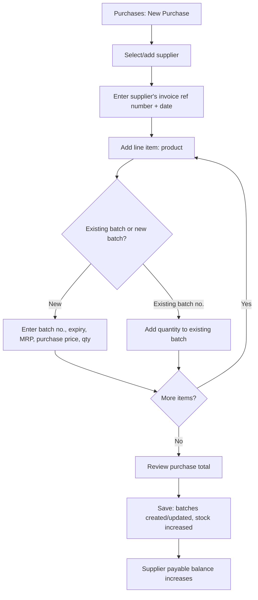
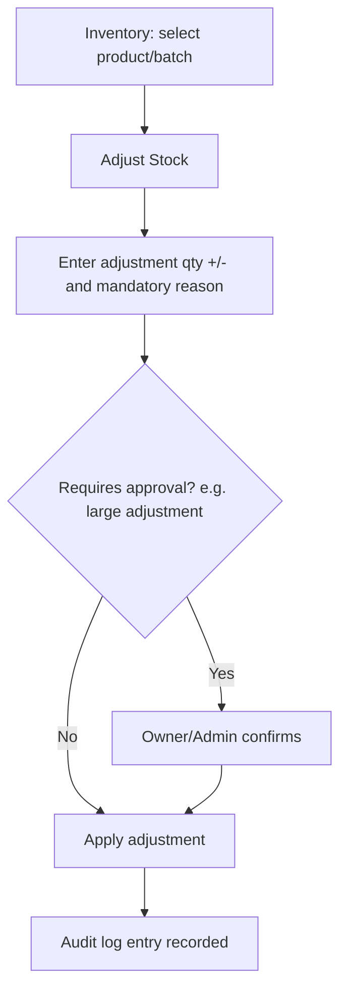
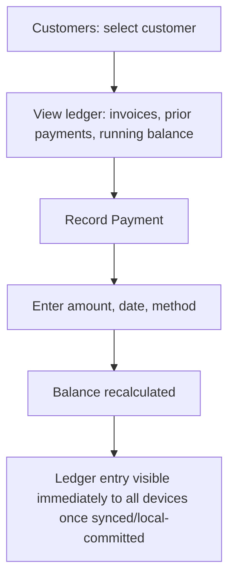
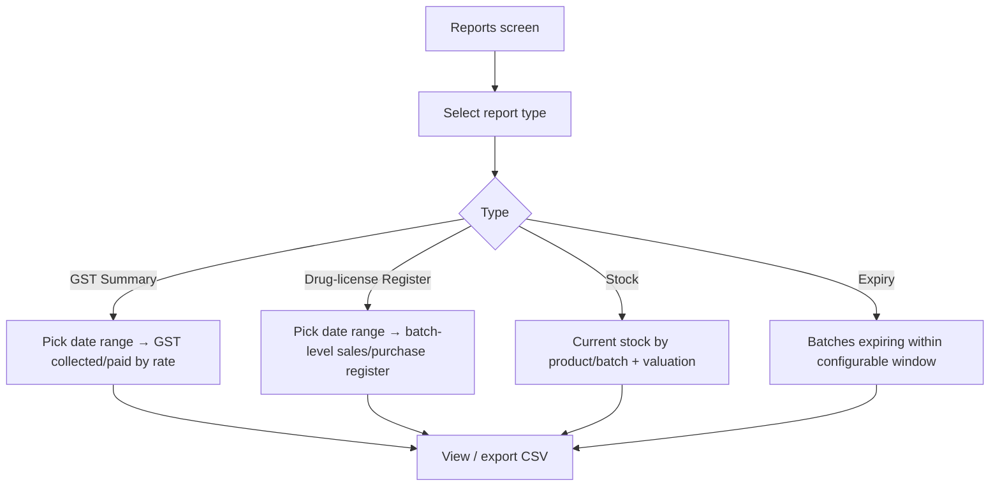
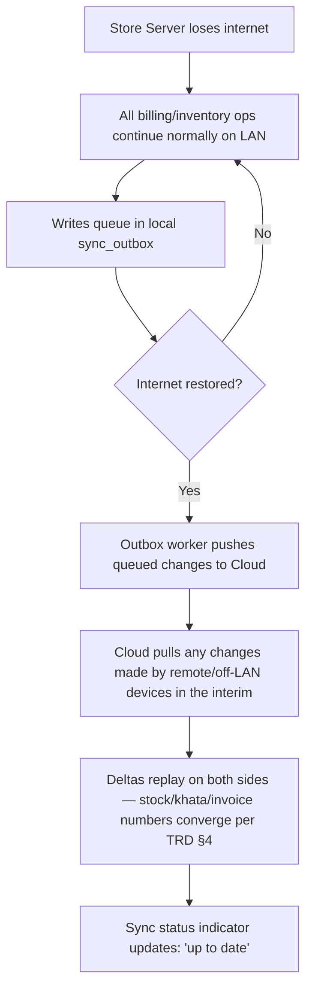

# App Flow Document

**Product:** MedERP | **Version:** 1.0 (Draft) | **Date:** 24 Aug 2026

Step-by-step flows for every core journey. Diagrams use Mermaid syntax (renders in GitHub, VS Code, Obsidian, etc.). Each flow references the functional requirements it satisfies.

---

## 1. Login & Session (FR-AUTH-001–004)



## 2. New Retail Sale (walk-in consumer) — FR-SAL-001–009



## 3. New Wholesale Sale (retailer customer, khata-eligible) — FR-SAL-001–007, FR-CUS-002



## 4. Purchase Entry / GRN — FR-PUR-001–005



## 5. Stock Adjustment — FR-INV-008



## 6. Customer Khata Payment Collection — FR-CUS-003



## 7. Sales Return — FR-RET-001

```mermaid
flowchart TD
    A[Sales: locate original invoice] --> B[Select line item(s) to return]
    B --> C[Enter return quantity + reason]
    C --> D{Return value exceeds approval threshold?}
    D -- Yes --> E[Owner/Admin approves]
    D -- No --> F[Process return]
    E --> F
    F --> G[Stock added back to originating batch]
    G --> H{Customer type}
    H -- Wholesale/khata --> I[Khata balance reduced]
    H -- Retail --> J[Refund recorded]
```

## 8. Purchase Return — FR-RET-002

```mermaid
flowchart TD
    A[Purchases: locate original purchase] --> B[Select line item(s) to return]
    B --> C[Enter return quantity + reason]
    C --> D[Batch quantity reduced]
    D --> E[Supplier payable reduced]
```

## 9. End-of-Day / Reporting — FR-RPT-001–007



## 10. Sync / Reconnection Flow — FR-SYNC-001–004



---

## Notes for implementers

- Flows 2 and 3 share the same underlying billing engine — the split is customer-type selection at the start plus different pricing/payment rules downstream, not two separate code paths. Keep this unified in the backend to avoid drift.
- FEFO allocation (Flows 2 & 3, step "auto-allocates batch") is the single most safety-critical piece of business logic in the app — it should be one well-tested, shared function, not duplicated per flow.
- Every flow that changes stock, khata, or supplier balances must be wrapped in a single DB transaction — partial application (e.g., stock deducted but invoice not created) is a data-integrity failure per NFR-006.
