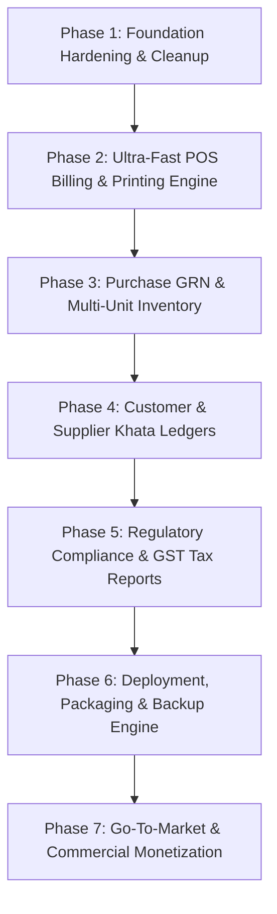

# MedStock ERP — Commercial Production Blueprint & Phased Roadmap

> **Document Goal:** Transform the existing codebase from a prototype into a high-speed, legally compliant, rock-solid pharmaceutical ERP that is ready for deployment in real pharmacies and wholesale stockists to generate revenue.

---

## 1. Executive Diagnosis: Why the Current Build is Not Commercial-Grade

Before writing new code, we must understand why real pharmacy owners and wholesale stockists would reject the current build:

| Area | Current Defect / Gap | Real Pharmacy Reality & Business Impact |
| :--- | :--- | :--- |
| **1. Billing Flow Friction** | Clicking "Finalize & Print" merely resets the form and shows a toast. Multiple batches trigger an intrusive modal dialog. | Cashiers bill 40–80 customers per hour during rush periods. Every modal popup and mouse click adds 4–8 seconds per bill. Lack of immediate physical print makes it unusable at a counter. |
| **2. Printing & Hardware** | Only standard browser `window.print()` exists on a sub-route. No 80mm/3-inch thermal POS receipt format, no A4/A5 half-page GST invoice print layout, and no ESC/POS raw hardware support. | 95% of retail chemists use 3-inch thermal printers; wholesalers use dot-matrix or laser A4/A5 half-sheet pre-printed invoices. Without formatted receipts, no store can operate. |
| **3. Purchase (GRN) Disconnect** | `purchaseRepository.ts` hardcodes purchases as `paidAmount = totalAmount, dueAmount = 0, paymentStatus = 'paid'`. Multi-unit conversions (Boxes → Strips) are missing. | Pharma stockists buy 90% of stock on 21-to-45 day credit. If supplier invoices don't feed into payables and multi-unit conversions don't calculate strip cost, inventory and money tracking break immediately. |
| **4. Fake Settings & Mock Access** | `saveProfile()` in Settings only runs `console.log()`. User management uses hardcoded mock arrays. Store name, GSTIN, DL numbers never save to DB. | A buyer cannot even enter their store name or drug licenses. |
| **5. Artificial "Subscription Lockout"** | `+layout.svelte` gates access using an arbitrary localStorage subscription check (`ShieldAlert: Subscription Payment Required`) with dummy plans and mock payment triggers. | It gives the illusion of a SaaS paywall while the core ERP cannot save settings or print bills. A real customer will see a lockout screen and abandon the product. |
| **6. Customer On-The-Fly Creation** | During billing, if a new customer or clinic arrives, the cashier must leave the POS screen or deal with an incomplete search component. | Counter staff must be able to type a new phone number and customer name directly in the billing bar and hit `Enter` to create them without leaving the invoice. |
| **7. Multi-Unit Pricing (Box vs Strip vs Tablet)** | Line items in billing don't allow selecting packaging units with dynamic price adjustment (e.g., ₹120/Box vs ₹13/Strip). | Chemist stores sell in strips and loose tablets while buying in boxes. Without packaging conversions, stock counts and prices are always incorrect. |

---

## 2. Target UI/UX Architecture: "The Clinical Console v2"

The design philosophy for MedStock ERP is **zero-latency, high-density, keyboard-dominant data entry** inspired by the speed of legacy software like Marg ERP, combined with the clean visual structure of a modern enterprise application.

### 2.1 The Ergonomic 65/35 POS Screen Division

```
┌──────────────────────────────────────────────────────────────────────────────────────────────────────────────────┐
│ TOP BAR: Store Name • Invoice #INV-2026-0042 • Cashier: Admin • Mode: [F8 Retail] • Date: 2026-10-07 • Status: Synced │
├────────────────────────────────────────────────────────────────────┬─────────────────────────────────────────────┤
│ LEFT PANEL (65% Width) — TRANSACTION ENTRY & GRID                  │ RIGHT PANEL (35% Width) — SUMMARY & SETTLE  │
│                                                                    │                                             │
│ 1. SEARCH BAR (Auto-focused on load & after every bill):           │ 1. CUSTOMER & PATIENT COMPLIANCE            │
│    [ F2: Search Medicine by Name / Salt / Barcode         ]        │    Customer: [Walk-in Consumer      ] (F3)  │
│    * Inline dropdown: Name | Pack | Stock | Expiry | MRP | PTR     │    Phone:    [9876543210            ]       │
│                                                                    │    Doctor:   [Dr. S. K. Gupta       ]       │
│ 2. LINE ITEMS GRID (Dense 28px rows, Tab/Enter auto-advance):      │    Reg No:   [UP-MCI-48201          ]       │
│ ┌───┬──────────────────┬───────┬────────┬─────┬──────┬─────┬─────┐ │                                             │
│ │#  │Medicine          │Batch  │Expiry  │Unit │Qty   │Rate │Tot  │ │ 2. FINANCIAL TOTALS                         │
│ ├───┼──────────────────┼───────┼────────┼─────┼──────┼─────┼─────┤ │    Subtotal:                   ₹1,240.00  │
│ │1  │Dolo 650mg        │DL849  │12/2027 │Str  │ 2    │30.00│60.00│ │    Item Discounts:              - ₹40.00  │
│ │2  │Augmentin 625mg   │AG102  │04/2026 │Str  │ 1    │220.0│220.0│ │    Taxable Turnover:           ₹1,200.00  │
│ │3  │Alprazolam 0.25*  │AL991  │09/2026 │Str  │ 1    │45.00│45.00│ │    CGST (6%):                    ₹72.00  │
│ └───┴──────────────────┴───────┴────────┴─────┴──────┴─────┴─────┘ │    SGST (6%):                    ₹72.00  │
│    *Schedule H1 item highlights row in subtle violet               │    Round Off:                    +  ₹0.00  │
│                                                                    │    ───────────────────────────────────────  │
│ 3. ACTIVE ROW INSPECTOR (Bottom ribbon):                           │    GRAND TOTAL:             ₹1,344.00       │
│    Selected: Augmentin 625mg | Mfd: GSK | HSN: 30042099            │                                             │
│    Batch AG102 Stock: 42 Strips | Cost: ₹175.00 | Margin: 20.4%    │ 3. PAYMENT SETTLEMENT (F4 Cycle)            │
│    Rack: B-12 | Alt Substitutes: Clavam 625, Moxikind-CV 625       │    Mode: [ CASH ] [ UPI ] [ CREDIT KHATA ]  │
│                                                                    │    Cash Tendered: [ ₹2,000.00           ]  │
│                                                                    │    Change to Return:  ₹656.00 (Bold Green)  │
│                                                                    │                                             │
│                                                                    │ 4. ACTIONS                                  │
│                                                                    │    [F10 / Ctrl+S] SAVE & PRINT INVOICE      │
│                                                                    │    [F6] HOLD BILL  •  [F7] RECALL HELD (2)  │
└────────────────────────────────────────────────────────────────────┴─────────────────────────────────────────────┘
```

### 2.2 Global Keyboard Ergonomics Matrix

A pharmacy clerk must be able to conduct 100% of counter operations without touching a mouse:

| Key Binding | Screen Scope | Direct Action Triggered |
| :--- | :--- | :--- |
| **`F2`** | POS / Billing | Jump focus directly to Medicine Search Input. |
| **`F3`** | POS / Billing | Jump focus to Customer Search / Phone input. |
| **`F4`** | POS / Billing | Cycle Payment Method: Cash $\rightarrow$ UPI $\rightarrow$ Credit Khata $\rightarrow$ Card. |
| **`F6`** | POS / Billing | Park / Hold active bill and clear screen for the next customer in queue. |
| **`F7`** | POS / Billing | Open Parked Bills drawer to recall a previous customer's bill. |
| **`F8`** | POS / Billing | Toggle Rate Tier: Retail (MRP basis) $\leftrightarrow$ Wholesale (PTR basis). |
| **`F10` or `Ctrl+S`** | POS / Billing | Finalize sale, trigger direct thermal/A4 print, and reset for next sale. |
| **`Down Arrow`** | Search dropdown | Navigate candidate batches/products without pressing Tab. |
| **`Enter`** | Grid Inputs | Advance cursor to next field: Product $\rightarrow$ Batch $\rightarrow$ Qty $\rightarrow$ Unit $\rightarrow$ Next Line. |
| **`Delete` / `Ctrl+Del`** | Grid Inputs | Remove selected line item from active bill. |
| **`Escape`** | Global | Close any active modal, drawer, or cancel search popup. |
| **`Ctrl+K`** | Global | Universal search across products, customer ledgers, and invoice numbers. |
| **`Ctrl+P`** | Invoice View | Direct print current document. |

### 2.3 Visual Design Tokens & Clinical Styling System

- **Background Palette:** High-contrast neutral slate (`#f8fafc` canvas, `#ffffff` panels, `#0f172a` text).
- **Table Density:** 28px–32px row height, compact 8px horizontal padding, crisp 1px borders (`#e2e8f0`).
- **Tabular Figures:** All money, quantities, batches, and phone numbers rendered in `font-mono tabular-nums`.
- **Statutory Violet:** `#7c3aed` reserved strictly for Schedule H, H1, and X medicines, prescription warnings, and Doctor Medical Registration prompts.
- **Expiry Amber:** `#d97706` for batches expiring within 90 days.
- **Critical Red:** `#dc2626` for expired batches, overdue khata limits, or stock-out alerts.
- **Healthy Emerald:** `#16a34a` for active stock, settled invoices, and positive cash flow.

---

## 3. Phased Implementation Roadmap



---

### Phase 1: Foundation Hardening & Core Architecture Cleanup

**Objective:** Remove prototype artifacts, wire all mock settings to the real PostgreSQL database, enforce integer paise arithmetic everywhere, and eliminate fake blockers.

#### Detailed Tasks:
1. **Remove Artificial Subscription Lock:**
   - In [src/routes/+layout.svelte](file:///Users/atul/develop/build-medical/src/routes/+layout.svelte), remove the blocking `isLocked` condition that displays the `Subscription Payment Required` error banner.
   - Retain `/subscription` as an administrative license & renewal info page, but ensure the core ERP functionality is 100% unlocked for authenticated users.
2. **Wire Real Database Persistence in Settings:**
   - Connect [src/routes/settings/+page.svelte](file:///Users/atul/develop/build-medical/src/routes/settings/+page.svelte) to `GET /api/settings` and `POST /api/settings`.
   - Update `storesTable` with store name, address, GSTIN, Drug License numbers (20B, 21B), phone number, and custom invoice terms.
   - Implement real user management in Settings: create new biller/admin accounts, reset passwords, toggle active status against `usersTable`.
3. **Verify Integer Paise & Money Integrity:**
   - Audit all database repositories to ensure no raw floating-point operations occur on financials.
   - Standardize all currency handling on `src/lib/server/billing/money.ts` (`toPaise`, `fromPaise`, `roundToRupee`).
4. **Seed Real Indian Pharmaceutical Dataset:**
   - Ensure the database is pre-seeded with 100+ standard Indian formulations (Paracetamol, Amoxicillin-Clavulanic, Telmisartan, Pantoprazole, Azithromycin, Cough Syrups, Insulin) with realistic HSN codes, GST slabs (0%, 5%, 12%, 18%), and multi-unit packings.

**Phase 1 Exit Criteria:**
- Store profile edits made in Settings persist across restarts and display on invoices.
- Cashier and Admin user accounts can be created and logged into with proper role enforcement.
- Zero mock data remains in the service or repository layer.

---

### Phase 2: Ultra-Fast Counter POS & Billing Engine (The Core Revenue Driver)

**Objective:** Make the New Sale screen the fastest, most reliable billing experience possible, complete with real receipt and GST invoice printing.

#### Detailed Tasks:
1. **Redesign the POS Screen (`/sales/new`):**
   - Implement the 65/35 ergonomic layout.
   - **Inline Batch Selector:** When searching a medicine with multiple batches, display available batches directly in a sub-table dropdown below the search bar with expiry date, stock, and MRP. Allow navigating with `Down Arrow` and selecting with `Enter`. No full-screen modal interruptions.
   - **Auto-Advance Cursor:** Typing Quantity and hitting `Enter` immediately adds the item and returns the focus to the Medicine Search field (`F2`).
2. **On-the-Fly Quick Customer Registration:**
   - In the Customer field (`F3`), typing an unknown phone number pops a 2-field inline prompt: `[ Customer Name ] [ Credit Limit ]`. Hitting `Enter` saves the customer and attaches them to the invoice without leaving the bill.
3. **Packaging Unit Conversion in Billing:**
   - Allow selecting Unit per line item (`Box`, `Strip`, `Tablet`).
   - Automatically calculate the line rate based on unit conversion factors (e.g., 1 Box = 10 Strips = 100 Tablets).
4. **Production-Ready Printing Subsystem:**
   - **80mm Thermal Receipt Layout:** Built with clean CSS media queries (`@media print`) and monospace typography. Outputs:
     - Store Name, Address, GSTIN, DL Nos.
     - Invoice Number, Date, Time, Cashier Name.
     - Compact table: Item, Batch, Expiry, Qty, Rate, Amount.
     - GST Breakdown summary (CGST + SGST).
     - Tendered Cash and Change Returned.
     - Doctor Name & Reg No (if Schedule H/H1).
     - Barcode / QR Code for UPI payment.
   - **A4 / A5 Tax Invoice Layout:** Pre-configured for wholesale stockists who need formal GST invoices with buyer GSTIN, dispatch details, transport mode, and terms & conditions.
   - **Direct Print Trigger:** Finalizing a sale (`F10` / `Ctrl+S`) immediately opens the system print dialog with the appropriate template, prints in under 1 second, and resets the billing counter for the next customer.
5. **Parked / Held Bills Management:**
   - Refine `F6` hold and `F7` recall workflow so cashiers can service multiple counter customers simultaneously without losing cart items.

**Phase 2 Exit Criteria:**
- A cashier can complete a 5-item bill (Search $\rightarrow$ Select $\rightarrow$ Quantity $\rightarrow$ Tender $\rightarrow$ Print) in under 15 seconds purely using the keyboard.
- Printed thermal slip matches physical thermal paper dimensions without clipping or text wrapping issues.
- FEFO automatically picks the earliest non-expired batch; expired batches are hard-blocked.

---

### Phase 3: Real Inward GRN (Purchases) & Batch Inventory Engine

**Objective:** Handle vendor stock inwarding with exact landing cost calculations, multi-unit conversions, and batch inventory tracking.

#### Detailed Tasks:
1. **Inward GRN Entry Workflow (`/purchases/new`):**
   - Connect purchase entry directly to `purchaseRepository.ts` and ensure it creates proper payable records in `payments` and `suppliersTable`.
   - Capture Distributor Invoice Number, Invoice Date, Payment Due Date (Credit Period in days, e.g., 21 or 30 days).
2. **Multi-Unit Batch Creation:**
   - When entering inward stock: capture Box Quantity + Free Quantity (Schemes, e.g., 10+1 free).
   - Enter Pack Size (e.g., 10 strips per box).
   - Compute effective cost per strip:
     $$\text{Effective Strip Cost} = \frac{\text{Total Net Purchase Amount}}{(\text{Purchased Boxes} + \text{Free Boxes}) \times \text{Strips Per Box}}$$
   - Inward inventory into `batchesTable` in base units and update `batches.purchasePrice` with the true landing cost.
3. **Supplier Credit Terms & Payables Integration:**
   - Record purchases with `paymentStatus = 'credit'`, `paidAmount = 0`, and `dueAmount = totalAmount`.
   - Immediately credit the supplier's balance in the supplier ledger.
4. **Stock Adjustment & Audit Register:**
   - Build a quick stock audit screen for manual stocktakes, broken vials, or damaged foils.
   - Require a reason (`'Damage'`, `'Physical Count Correction'`, `'Supplier Return'`) and log an immutable delta into `batch_stock_events`.

**Phase 3 Exit Criteria:**
- Inwarding 10 boxes of a medicine creates the correct number of sellable strips/tablets with accurate expiry and batch records.
- The supplier's outstanding payable balance increases by the exact invoice amount.

---

### Phase 4: Dual-Party Khata & Financial Settlement (Customer & Supplier)

**Objective:** Provide rock-solid credit ledger management with partial settlements, outstanding aging, and ledger statement generation.

#### Detailed Tasks:
1. **Customer Khata Management (`/customers/[id]`):**
   - Complete chronological double-entry ledger showing Date, Voucher Type (Sale Invoice, Cash Receipt, Sales Return), Reference No, Debit, Credit, and Running Balance.
   - Outstanding Aging Analysis: Categorize dues into `< 30 days`, `30–60 days`, `60–90 days`, and `> 90 days (Overdue)`.
2. **Payment Receipt Voucher Entry (`/payments/receive`):**
   - Allow entering lump-sum receipts (e.g., Customer pays ₹5,000 via UPI).
   - Provide FIFO invoice settlement: automatically apply the payment against the oldest unpaid invoices, reducing their `dueAmount`.
   - Generate printable Money Receipt vouchers for the customer.
3. **Supplier Payables & Disbursement (`/payments/pay`):**
   - Record payments made to pharmaceutical distributors via Cheque, NEFT/RTGS, or Cash with Cheque/Transaction reference numbers.
   - Deduct payable balances and maintain audit history.
4. **WhatsApp / SMS Ledger Statement Dispatch:**
   - Format a clean text summary of customer dues with payment link/UPI QR details that can be sent via WhatsApp with a single click.

**Phase 4 Exit Criteria:**
- Partial payment against a ₹10,000 credit sale accurately reflects ₹6,000 outstanding balance in the ledger.
- Ledger reports tie out to the exact rupee against all historical invoices and payment receipts.

---

### Phase 5: Regulatory Compliance & GST Tax Reporting

**Objective:** Fulfill all legal requirements under the Drugs & Cosmetics Act, 1940 and Indian GST statutory guidelines so the store can pass government audits.

#### Detailed Tasks:
1. **Schedule H / H1 / X Narcotic Statutory Register:**
   - Polish [src/routes/reports/schedule-h1/+page.svelte](file:///Users/atul/develop/build-medical/src/routes/reports/schedule-h1/+page.svelte) to match official **Form 35** statutory inspection register format:
     - Columns: Date | Patient Name & Address | Prescribing Doctor Name & Reg No | Drug Name | Batch No | Qty Dispensed | Balance Stock | Pharmacist Signature.
   - Add one-click "Print Inspection Register" and "Export Excel/CSV" for Drug Inspector audits.
2. **GST Filing Reports (GSTR-1 & GSTR-3B):**
   - Ensure [src/routes/reports/gst/+page.svelte](file:///Users/atul/develop/build-medical/src/routes/reports/gst/+page.svelte) properly generates:
     - **B2B Table (4A, 4B, 6B):** Invoices with Customer GSTIN, broken down by tax slab (5%, 12%, 18%).
     - **B2C Table (7):** Net consumer turnover and tax split by State code.
     - **HSN-wise Summary Table (12):** HSN code, Total Quantity, Total Value, Taxable Value, CGST, SGST, IGST.
   - Add one-click CSV export formatted to match the GST Portal offline upload utility.
3. **Stock Expiry Risk & Disposal Report:**
   - List all batches expiring within 30, 60, and 90 days with supplier names to facilitate returning near-expiry stock before the return window closes.

**Phase 5 Exit Criteria:**
- Exported HSN and GSTR-1 CSV files can be imported directly into Indian GST filing software without column errors.
- Schedule H1 report accurately tracks all dispensed restricted formulations with prescriber details.

---

### Phase 6: Deployment, Packaging & Local Appliance Setup

**Objective:** Package the application so it can run reliably in physical stores on standard Windows/Linux hardware with zero internet dependency.

#### Detailed Tasks:
1. **Single-Command Local Store Server Setup:**
   - Create a lightweight installation package (`scripts/install-store-server.sh` or Windows `.bat` / Docker Compose) that sets up:
     - Node.js runtime + PostgreSQL database.
     - Automatic database schema migration & seeding.
     - Automatic background system service that restarts on machine reboot.
2. **Offline-First LAN Configuration:**
   - Configure the Store Server to bind to LAN IP (`0.0.0.0:3000`).
   - Create a client pairing view (`/settings/network`) showing the local server IP and a QR code so tablets or other counter PCs can connect instantly over store Wi-Fi.
3. **Automated Daily Local Backup Engine:**
   - Implement an automated cron/service that creates a compressed database dump (`pg_dump`) every night at 11:59 PM to a local backup directory (`./backups`) and optional external USB drive.
4. **Tauri Desktop Shell (Optional Native Wrapper):**
   - Wrap the frontend in a lightweight Tauri desktop executable for Windows/Linux counters, providing direct access to hardware serial/USB thermal printers.

**Phase 6 Exit Criteria:**
- The application boots up automatically when the store PC powers on.
- Multiple counter devices on the local Wi-Fi can bill simultaneously with zero internet connection.
- A nightly backup is verified and can be restored with a single script.

---

### Phase 7: Commercialization & Revenue Generation Strategy

**Objective:** Package, price, and sell MedStock ERP to pharmacy retailers and wholesale stockists to generate immediate cash flow.

#### Monetization Models:

```
┌─────────────────────────────────────────────────────────────────────────────────────────────────┐
│                                 COMMERCIAL MONETIZATION PATHS                                   │
├───────────────────────────────────────────────┬─────────────────────────────────────────────────┤
│ MODEL A: LOCAL ON-PREMISE LICENSE (Immediate) │ MODEL B: HYBRID CLOUD SAAS (Recurring)          │
├───────────────────────────────────────────────┼─────────────────────────────────────────────────┤
│ • Best for: Independent pharmacies/stockists   │ • Best for: Multi-store owners, modern clinics  │
│ • Setup Fee: ₹15,000 – ₹25,000 (one-time)     │ • Pricing: ₹1,499 / month or ₹14,999 / year     │
│ • AMC (Annual Maintenance): ₹5,000 / year     │ • Includes: Cloud backup, multi-device sync,    │
│ • Deliverable: Installed on store server PC,  │   owner mobile dashboard, WhatsApp billing      │
│   thermal printer configured, staff trained   │ • Billing: Razorpay recurring subscription      │
└───────────────────────────────────────────────┴─────────────────────────────────────────────────┘
```

#### Immediate Go-To-Market Steps:
1. **Pilot Deployment (The Benchmark Store):**
   - Deploy at the target family-owned store (in Ballia, UP) or a friendly local pharmacy.
   - Run parallel billing alongside their existing manual register or Marg system for 7 days.
   - Resolve every counter delay and keyboard paper-cut reported by the cashier.
2. **Sales Demo Kit:**
   - Prepare a pre-seeded, high-polish demo environment running on a laptop with a portable 80mm USB thermal printer.
   - Create a 3-minute video showing:
     - 10-second sale completion using only the keyboard.
     - Instant thermal invoice print.
     - Drug inspector statutory H1 report generation in 1 click.
     - Customer Khata reminder sent to WhatsApp.
3. **Hardware Bundling (Margin Multiplier):**
   - Partner with local hardware vendors to sell complete turnkey packages:
     - Refurbished Core i3 PC + 80mm Thermal Printer + 2D Barcode Scanner + MedStock ERP License = **₹35,000 bundle** (Profit margin: ₹15,000–₹18,000 per installation).

---

## 4. Immediate Next Steps & Execution Order

To make the fastest progress toward a deployable, money-making product, the development work should proceed in this specific sequence:

1. **Step 1:** Unlock the app shell by stripping out the fake subscription blocker in `+layout.svelte`, and connect the Store Profile in Settings to real database persistence.
2. **Step 2:** Upgrade the POS Billing terminal (`/sales/new`): replace the batch selection modal with a fast inline keyboard dropdown, wire the auto-advance cursor, and build the 80mm thermal receipt print template.
3. **Step 3:** Fix the purchase repository (`purchaseRepository.ts`) to handle real credit terms, calculate true landing cost per strip, and link to supplier payables.
4. **Step 4:** Deploy and verify on target hardware with a real thermal printer.
